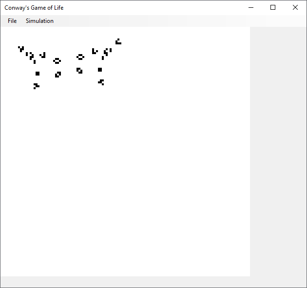

# Conway's Game of Life
Conway's Game of Life is a Turing complete cellular automaton.

Due to the fact that it is a zero-player game, the interaction is done by supplying the initial configuration as a black and white picture and observing how it evolves.

## Rules
The rules are simple:
- Any live cell with 2 or 3 live neighbours survives
- Any dead cell with 3 live neighbours becomes a live cell
- All other live cells die in the next generation
- All other dead cells stay dead in the next generation

## Images
